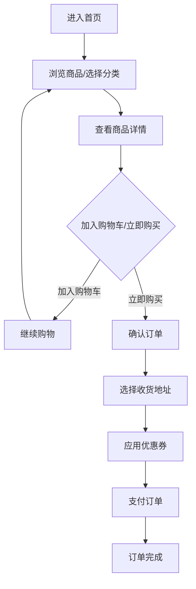
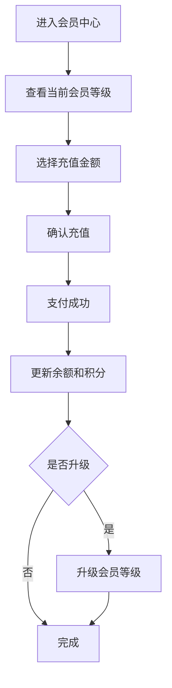
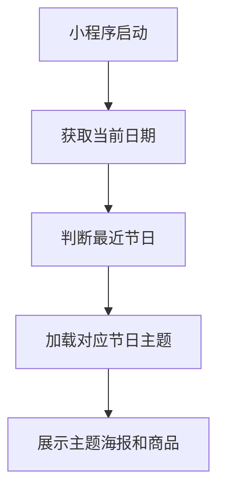

## 1. Product Overview
花韵花店小程序是一款专注于鲜花销售的移动端应用，旨在为用户提供便捷的购花体验，通过会员体系提升用户粘性，并根据节日主题动态调整首页展示。

## 2. Core Features

### 2.1 User Roles
| Role | Registration Method | Core Permissions |
|------|---------------------|------------------|
| Normal User | WeChat login | Browse products, add to cart, place orders |
| Member User | WeChat login + Recharge | Member discounts, birthday benefits, exclusive offers |

### 2.2 Feature Module
1. **首页**: 节日主题切换、轮播图、分类导航、热销商品、新品推荐
2. **点单页**: 商品分类、商品列表、商品详情、加入购物车、结算
3. **购物车**: 商品列表、数量调整、删除商品、全选、结算
4. **会员中心**: 会员等级展示、余额充值、积分查询、会员权益
5. **我的**: 订单管理、地址管理、优惠券、设置

### 2.3 Page Details
| Page Name | Module Name | Feature description |
|-----------|-------------|---------------------|
| 首页 | 节日主题 | 根据当前日期自动切换节日主题（情人节、母亲节、父亲节、高考、教师节、圣诞节等），展示对应主题海报和商品推荐 |
| 首页 | 轮播图 | 展示热门活动、新品上市、节日特惠等内容，支持点击跳转 |
| 首页 | 分类导航 | 展示鲜花分类（玫瑰、百合、康乃馨、向日葵等），点击进入分类商品列表 |
| 首页 | 热销商品 | 展示销量最高的商品，显示价格和销量 |
| 首页 | 新品推荐 | 展示最新上架的商品 |
| 点单页 | 商品分类 | 左侧分类导航，右侧商品列表，支持筛选 |
| 点单页 | 商品详情 | 商品图片、名称、价格、规格选择、加入购物车、立即购买 |
| 购物车 | 商品列表 | 展示已加入购物车的商品，支持数量增减、删除、全选 |
| 购物车 | 结算 | 计算总价，应用优惠券，提交订单 |
| 会员中心 | 会员等级 | 展示当前会员等级（普通会员、银卡会员、金卡会员、钻石会员），显示升级进度 |
| 会员中心 | 余额充值 | 支持多种充值金额，充值越多会员等级越高 |
| 会员中心 | 积分查询 | 展示当前积分、积分明细 |
| 会员中心 | 会员权益 | 展示对应等级的会员特权（折扣、生日礼、专属客服等） |
| 我的 | 订单管理 | 订单列表，支持查看订单详情、取消订单、确认收货 |
| 我的 | 地址管理 | 收货地址列表，支持添加、编辑、删除地址 |
| 我的 | 优惠券 | 优惠券列表，支持查看使用条件和有效期 |

## 3. Core Process

### 用户购花流程

### 会员充值流程

### 节日主题切换流程

## 4. User Interface Design

### 4.1 Design Style
- **Primary Color**: 粉色系（#FF6B9D）- 代表浪漫、温馨
- **Secondary Color**: 绿色系（#4ECDC4）- 代表自然、生机
- **Button Style**: 圆角矩形，渐变色填充，hover效果
- **Font**: 微软雅黑/苹方，简洁现代
- **Layout**: 卡片式布局，瀑布流商品展示
- **Icon Style**: 线性图标，简洁清晰

### 4.2 Page Design Overview

| Page Name | Module Name | UI Elements |
|-----------|-------------|-------------|
| 首页 | 节日主题栏 | 主题背景图、节日名称、主题标语、切换动画 |
| 首页 | 轮播图 | 横向滑动、指示器、自动播放 |
| 首页 | 分类导航 | 圆形图标+文字、网格布局 |
| 首页 | 商品展示 | 卡片式、圆角阴影、价格标签 |
| 点单页 | 分类导航 | 左侧列表、右侧瀑布流 |
| 点单页 | 商品卡片 | 图片、名称、价格、加入购物车按钮 |
| 购物车 | 商品项 | 勾选框、图片、名称、数量控制器、价格 |
| 会员中心 | 等级展示 | 等级图标、等级名称、进度条 |
| 会员中心 | 充值面板 | 金额选项、充值按钮、会员权益说明 |

### 4.3 Responsiveness
- Mobile-first design
- 适配不同屏幕尺寸（375px - 414px）
- Touch-friendly button size (>44px)
- 横屏适配

## 5. Member System

### 5.1 Member Levels
| Level | Name | Recharge Amount | Discount | Benefits |
|-------|------|------------------|----------|----------|
| 1 | 普通会员 | 0 | 无 | 基础服务 |
| 2 | 银卡会员 | ≥100 | 9.5折 | 生日礼、专属客服 |
| 3 | 金卡会员 | ≥500 | 9折 | 生日礼、专属客服、优先配送 |
| 4 | 钻石会员 | ≥1000 | 8.5折 | 生日礼、专属客服、优先配送、专属折扣 |

### 5.2 Points Rule
- 充值1元 = 1积分
- 消费1元 = 0.5积分
- 积分可兑换优惠券或商品

## 6. Holiday Themes

### 6.1 Supported Holidays
| Holiday | Date | Theme Color |
|---------|------|-------------|
| 情人节 | 2月14日 | 红色/粉色 |
| 妇女节 | 3月8日 | 紫色/粉色 |
| 母亲节 | 5月第二个周日 | 粉色/康乃馨色 |
| 父亲节 | 6月第三个周日 | 蓝色/黄色 |
| 高考 | 6月7-8日 | 红色/金色 |
| 教师节 | 9月10日 | 黄色/白色 |
| 中秋节 | 农历八月十五 | 金色/红色 |
| 国庆节 | 10月1日 | 红色/黄色 |
| 圣诞节 | 12月25日 | 红色/绿色 |

### 6.2 Theme Switching Logic
- 节日前7天开始展示节日主题
- 节日当天展示完整节日主题
- 节日后3天恢复正常主题
- 支持手动切换主题（管理员）