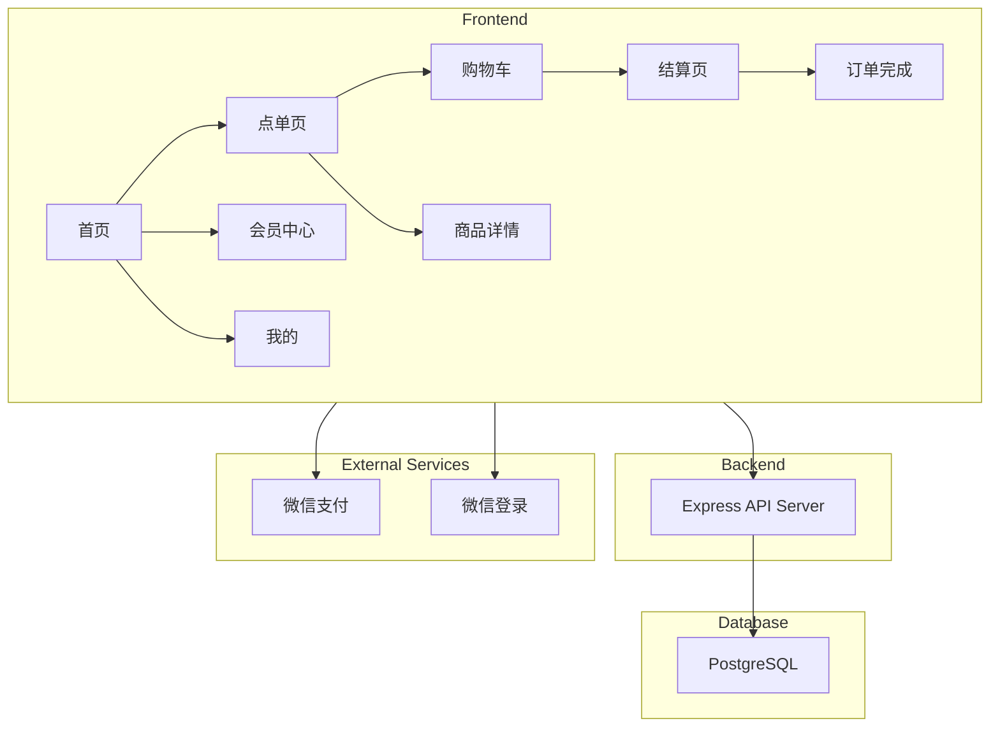
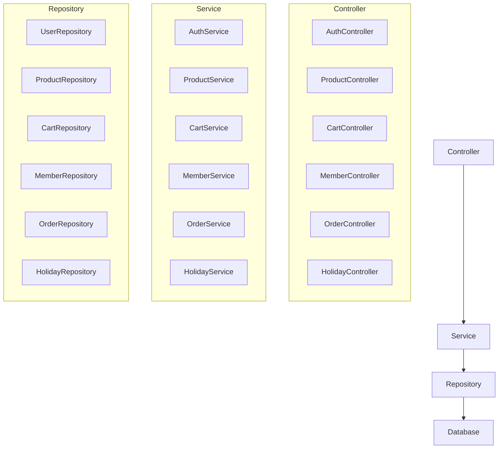

## 1. Architecture Design



## 2. Technology Description

- **Frontend**: UniApp (Vue3 + TypeScript)
- **UI Framework**: UniUI / uView Plus
- **Build Tool**: Vite
- **Backend**: Express@4 + TypeScript
- **Database**: PostgreSQL
- **ORM**: Prisma
- **Authentication**: WeChat OAuth2
- **Payment**: WeChat Pay API

## 3. Route Definitions

| Route | Purpose | Component |
|-------|---------|-----------|
| /pages/index/index | 首页 | IndexPage |
| /pages/order/order | 点单页 | OrderPage |
| /pages/product/detail | 商品详情 | ProductDetail |
| /pages/cart/cart | 购物车 | CartPage |
| /pages/checkout/checkout | 结算页 | CheckoutPage |
| /pages/member/member | 会员中心 | MemberPage |
| /pages/mine/mine | 我的 | MinePage |
| /pages/orders/list | 订单列表 | OrdersList |
| /pages/address/list | 地址管理 | AddressList |

## 4. API Definitions

### 4.1 Authentication APIs

#### POST /api/auth/login
**Request:**
```typescript
interface LoginRequest {
  code: string; // 微信登录code
}
```

**Response:**
```typescript
interface LoginResponse {
  token: string;
  user: User;
}
```

### 4.2 Product APIs

#### GET /api/products
**Request:**
```typescript
interface ProductListRequest {
  category?: string;
  page?: number;
  size?: number;
}
```

**Response:**
```typescript
interface ProductListResponse {
  items: Product[];
  total: number;
}
```

#### GET /api/products/:id
**Response:**
```typescript
interface ProductResponse {
  product: Product;
}
```

#### POST /api/products
**Request:**
```typescript
interface ProductCreateRequest {
  name: string;
  price: number;
  originalPrice?: number;
  categoryId: number;
  description?: string;
  images: string[];
  stock: number;
  isHot?: boolean;
  isNew?: boolean;
}
```

### 4.3 Cart APIs

#### GET /api/cart
**Response:**
```typescript
interface CartResponse {
  items: CartItem[];
  total: number;
}
```

#### POST /api/cart
**Request:**
```typescript
interface CartAddRequest {
  productId: number;
  quantity: number;
  spec?: string;
}
```

#### PUT /api/cart/:id
**Request:**
```typescript
interface CartUpdateRequest {
  quantity: number;
}
```

#### DELETE /api/cart/:id

### 4.4 Member APIs

#### GET /api/member
**Response:**
```typescript
interface MemberResponse {
  level: number;
  levelName: string;
  balance: number;
  points: number;
  progress: number;
  benefits: string[];
}
```

#### POST /api/member/recharge
**Request:**
```typescript
interface RechargeRequest {
  amount: number;
}
```

**Response:**
```typescript
interface RechargeResponse {
  balance: number;
  points: number;
  level: number;
  levelName: string;
}
```

### 4.5 Order APIs

#### POST /api/orders
**Request:**
```typescript
interface OrderCreateRequest {
  items: OrderItem[];
  addressId: number;
  couponId?: number;
  remark?: string;
}
```

**Response:**
```typescript
interface OrderResponse {
  order: Order;
  payUrl: string;
}
```

#### GET /api/orders
**Response:**
```typescript
interface OrderListResponse {
  items: Order[];
  total: number;
}
```

### 4.6 Holiday APIs

#### GET /api/holiday/current
**Response:**
```typescript
interface HolidayResponse {
  id: number;
  name: string;
  date: string;
  themeColor: string;
  bannerImage: string;
  description: string;
  active: boolean;
}
```

## 5. Server Architecture Diagram



## 6. Data Model

### 6.1 Data Model Definition

```mermaid
erDiagram
    USER ||--o{ CART : has
    USER ||--o{ ORDER : places
    USER ||--o{ ADDRESS : has
    USER ||--o{ COUPON : owns
    PRODUCT ||--o{ CART_ITEM : contains
    PRODUCT ||--o{ ORDER_ITEM : contains
    PRODUCT ||--|{ CATEGORY : belongs_to
    ORDER ||--|{ ADDRESS : uses
    ORDER ||--o{ COUPON : uses
    HOLIDAY ||--o{ HOLIDAY_PRODUCT : features
    
    USER {
        id Int PK
        openid String Unique
        nickname String
        avatar String
        phone String
        level Int Default(1)
        balance Decimal Default(0)
        points Int Default(0)
        createdAt DateTime
        updatedAt DateTime
    }
    
    PRODUCT {
        id Int PK
        name String
        price Decimal
        originalPrice Decimal
        categoryId Int FK
        description Text
        images String[]
        stock Int
        isHot Boolean Default(false)
        isNew Boolean Default(false)
        createdAt DateTime
        updatedAt DateTime
    }
    
    CATEGORY {
        id Int PK
        name String
        icon String
        sortOrder Int
    }
    
    CART {
        id Int PK
        userId Int FK
        createdAt DateTime
        updatedAt DateTime
    }
    
    CART_ITEM {
        id Int PK
        cartId Int FK
        productId Int FK
        quantity Int
        spec String
    }
    
    ORDER {
        id Int PK
        orderNo String Unique
        userId Int FK
        addressId Int FK
        status String
        totalAmount Decimal
        payAmount Decimal
        couponId Int FK
        remark String
        payTime DateTime
        createdAt DateTime
    }
    
    ORDER_ITEM {
        id Int PK
        orderId Int FK
        productId Int FK
        quantity Int
        price Decimal
        spec String
    }
    
    ADDRESS {
        id Int PK
        userId Int FK
        name String
        phone String
        province String
        city String
        district String
        detail String
        isDefault Boolean Default(false)
    }
    
    COUPON {
        id Int PK
        name String
        type String
        value Decimal
        minAmount Decimal
        startDate DateTime
        endDate DateTime
        totalCount Int
        usedCount Int
    }
    
    HOLIDAY {
        id Int PK
        name String
        date String
        themeColor String
        bannerImage String
        description String
        active Boolean Default(false)
        sortOrder Int
    }
    
    HOLIDAY_PRODUCT {
        id Int PK
        holidayId Int FK
        productId Int FK
        sortOrder Int
    }
```

### 6.2 Data Definition Language

```sql
CREATE TABLE users (
    id SERIAL PRIMARY KEY,
    openid VARCHAR(100) UNIQUE NOT NULL,
    nickname VARCHAR(100),
    avatar VARCHAR(255),
    phone VARCHAR(20),
    level INT DEFAULT 1,
    balance DECIMAL(10,2) DEFAULT 0.00,
    points INT DEFAULT 0,
    created_at TIMESTAMP DEFAULT CURRENT_TIMESTAMP,
    updated_at TIMESTAMP DEFAULT CURRENT_TIMESTAMP
);

CREATE TABLE categories (
    id SERIAL PRIMARY KEY,
    name VARCHAR(50) NOT NULL,
    icon VARCHAR(100),
    sort_order INT DEFAULT 0
);

CREATE TABLE products (
    id SERIAL PRIMARY KEY,
    name VARCHAR(100) NOT NULL,
    price DECIMAL(10,2) NOT NULL,
    original_price DECIMAL(10,2),
    category_id INT REFERENCES categories(id),
    description TEXT,
    images TEXT[],
    stock INT DEFAULT 0,
    is_hot BOOLEAN DEFAULT FALSE,
    is_new BOOLEAN DEFAULT FALSE,
    created_at TIMESTAMP DEFAULT CURRENT_TIMESTAMP,
    updated_at TIMESTAMP DEFAULT CURRENT_TIMESTAMP
);

CREATE TABLE carts (
    id SERIAL PRIMARY KEY,
    user_id INT REFERENCES users(id),
    created_at TIMESTAMP DEFAULT CURRENT_TIMESTAMP,
    updated_at TIMESTAMP DEFAULT CURRENT_TIMESTAMP
);

CREATE TABLE cart_items (
    id SERIAL PRIMARY KEY,
    cart_id INT REFERENCES carts(id),
    product_id INT REFERENCES products(id),
    quantity INT DEFAULT 1,
    spec VARCHAR(100)
);

CREATE TABLE addresses (
    id SERIAL PRIMARY KEY,
    user_id INT REFERENCES users(id),
    name VARCHAR(50) NOT NULL,
    phone VARCHAR(20) NOT NULL,
    province VARCHAR(50),
    city VARCHAR(50),
    district VARCHAR(50),
    detail VARCHAR(200),
    is_default BOOLEAN DEFAULT FALSE
);

CREATE TABLE coupons (
    id SERIAL PRIMARY KEY,
    name VARCHAR(100) NOT NULL,
    type VARCHAR(20) DEFAULT 'discount',
    value DECIMAL(10,2) NOT NULL,
    min_amount DECIMAL(10,2) DEFAULT 0,
    start_date TIMESTAMP,
    end_date TIMESTAMP,
    total_count INT DEFAULT 100,
    used_count INT DEFAULT 0
);

CREATE TABLE orders (
    id SERIAL PRIMARY KEY,
    order_no VARCHAR(50) UNIQUE NOT NULL,
    user_id INT REFERENCES users(id),
    address_id INT REFERENCES addresses(id),
    status VARCHAR(20) DEFAULT 'pending',
    total_amount DECIMAL(10,2) NOT NULL,
    pay_amount DECIMAL(10,2) NOT NULL,
    coupon_id INT REFERENCES coupons(id),
    remark VARCHAR(200),
    pay_time TIMESTAMP,
    created_at TIMESTAMP DEFAULT CURRENT_TIMESTAMP
);

CREATE TABLE order_items (
    id SERIAL PRIMARY KEY,
    order_id INT REFERENCES orders(id),
    product_id INT REFERENCES products(id),
    quantity INT DEFAULT 1,
    price DECIMAL(10,2) NOT NULL,
    spec VARCHAR(100)
);

CREATE TABLE holidays (
    id SERIAL PRIMARY KEY,
    name VARCHAR(50) NOT NULL,
    date VARCHAR(20) NOT NULL,
    theme_color VARCHAR(20),
    banner_image VARCHAR(255),
    description VARCHAR(200),
    active BOOLEAN DEFAULT FALSE,
    sort_order INT DEFAULT 0
);

CREATE TABLE holiday_products (
    id SERIAL PRIMARY KEY,
    holiday_id INT REFERENCES holidays(id),
    product_id INT REFERENCES products(id),
    sort_order INT DEFAULT 0
);

INSERT INTO categories (name, icon, sort_order) VALUES
('玫瑰', '🌹', 1),
('百合', '🌸', 2),
('康乃馨', '💐', 3),
('向日葵', '🌻', 4),
('郁金香', '🌷', 5),
('满天星', '✨', 6),
('勿忘我', '💜', 7),
('混搭花束', '🎀', 8);

INSERT INTO holidays (name, date, theme_color, banner_image, description, active) VALUES
('情人节', '02-14', '#FF6B9D', '', '浪漫情人节，爱意满满', false),
('妇女节', '03-08', '#9B59B6', '', '致敬最美的她', false),
('母亲节', '05-sunday-2', '#FF8E72', '', '感恩母爱，温暖相伴', false),
('父亲节', '06-sunday-3', '#3498DB', '', '父爱如山，感恩有您', false),
('高考', '06-07', '#E74C3C', '', '金榜题名，前程似锦', false),
('教师节', '09-10', '#F1C40F', '', '师恩难忘，桃李芬芳', false),
('中秋节', '09-17', '#F39C12', '', '花好月圆，情意绵绵', false),
('国庆节', '10-01', '#E74C3C', '', '举国同庆，盛世华章', false),
('圣诞节', '12-25', '#E74C3C', '', '圣诞快乐，温馨祝福', false);
```